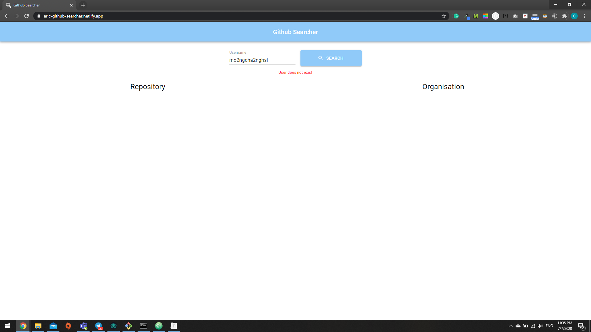
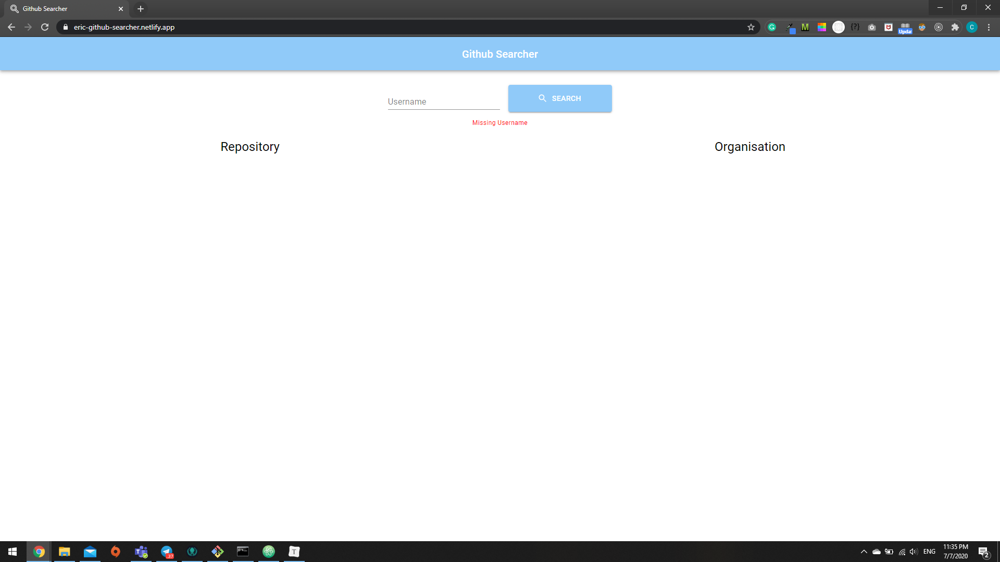
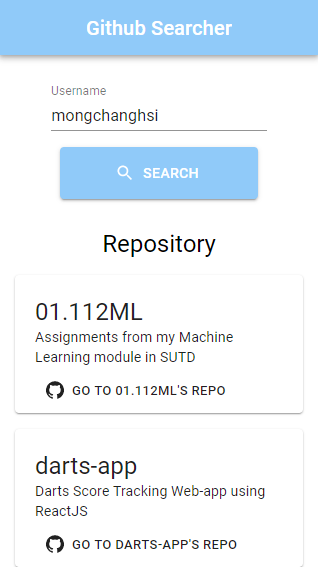

# Github-Searcher

Responsive Github searcher program using Github's API, allowing user to search for a user's repository, organization that the user is belonging to and quick access to specific repository

Bootstrapped using create-react-app and MaterialUI

Testing: Jest and Enzyme

Deployment: Netlify

Live Website: https://eric-github-searcher.netlify.app/

----------------------------------

### Instructions
1. Clone the repository
2. Using ```cmd``` and change the directory to the repository
3. Install npm using ```npm install```
4. Start the program using ```npm start```
5. Access the program via ```http://localhost:3000/``` from your browser

### Features
1. Inform user if there is an missing username input
2. Inform user if username input does not exist
3. Inform user if Github's user does not have any repository or organization
4. Allow user to access a specific repository after search
5. Scroll-to-top button

### Images








--------------------

End of Report
